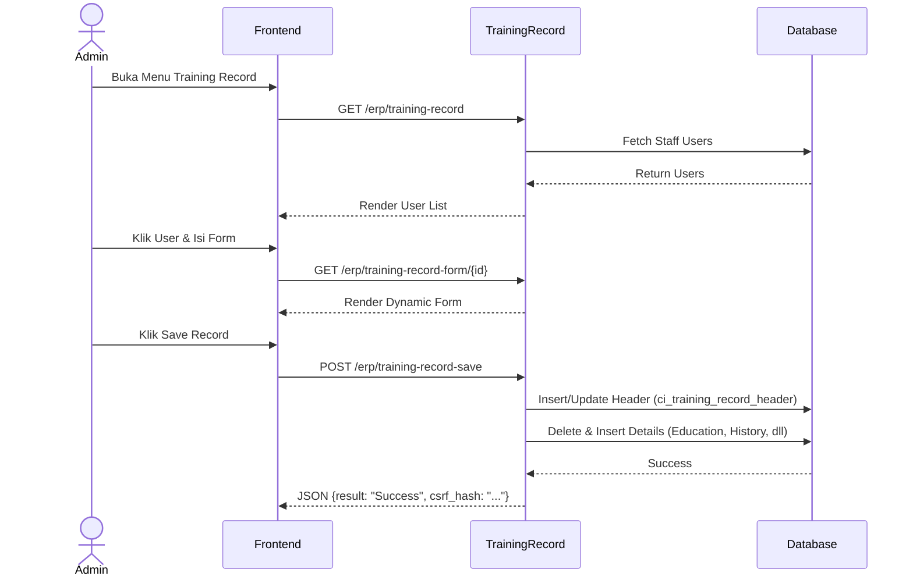
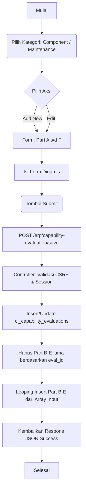
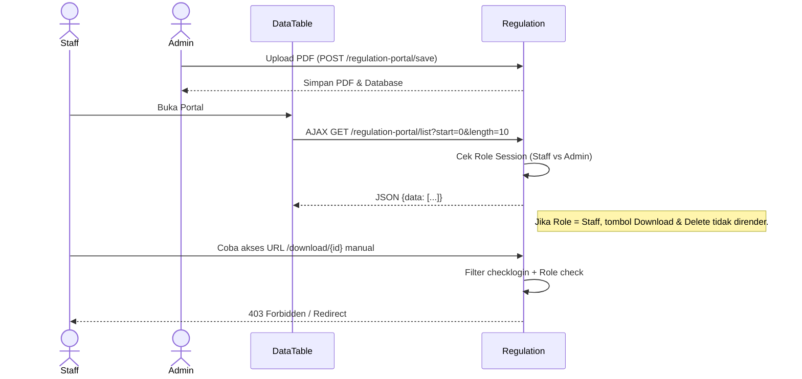

# System & Technical Documentation

Dokumen ini berisi penjelasan dari sisi fungsional (bisnis) dan sisi teknikal (implementasi kode) untuk modul **Training Record**, **Capability Evaluation**, dan **Company Manual Publication** pada sistem.

---

## 1. Training Record (CV Training)

### 1.1 Tujuan dan Fungsi
Fitur ini digunakan untuk mendata riwayat pendidikan, pelatihan, lisensi, dan sertifikat dasar karyawan (Staff). Data ini digunakan untuk mencetak *Training Record* / *CV Training* karyawan sebagai syarat kompetensi dan kualifikasi.

### 1.2 Alur Sistem (Business Flow)
1.  **Akses List**: Admin/Company melihat daftar karyawan. Karyawan (*staff*) juga bisa melihat rekam jejaknya sendiri melalui menu *My Record*.
2.  **Pengisian Form**: Admin dapat mengklik karyawan dan mengisi *form* (Pendidikan, Pelatihan, Lisensi). Form bersifat dinamis (dapat menambah baris data / *add row* tanpa batas).
3.  **Proses Tanda Tangan**: Dokumen membutuhkan legalisasi via tanda tangan. Sistem menangkap goresan melalui *Signature Pad* (HTML5 Canvas) yang kemudian disimpan.
4.  **Export PDF**: Data di-generate menjadi file PDF untuk arsip menggunakan *library* Mpdf/Dompdf ketika tombol "Print PDF" diklik.

### 1.3 Tabel Database
Data dipecah ke dalam beberapa tabel relasional berdasarkan *user_id* karyawan:
*   **`ci_training_record_header`** (`TrainingRecordHeaderModel`): Menyimpan data identitas utama.
*   **`ci_employee_education`** (`EmployeeEducationModel`): Menyimpan riwayat pendidikan.
*   **`ci_employee_training_history`** (`EmployeeTrainingHistoryModel`): Menyimpan riwayat pelatihan.
*   **`ci_employee_licenses`** (`EmployeeLicenseModel`): Menyimpan data lisensi (AMEL, Type Rating).
*   **`ci_employee_basic_certificates`** (`EmployeeBasicCertificateModel`): Menyimpan data sertifikat dasar.
*   **`ci_training_signatures`** (`TrainingSignatureModel`): Menyimpan data tanda tangan dalam bentuk *base64 image*.

### 1.4 Technical Sequence Flow

### 1.5 API & Endpoint Specification
Penyimpanan data pada aplikasi CI4 ini dikelola melalui AJAX POST (*local endpoint*) yang dilindungi **CSRF Protection**.

**A. Save Training Record**
- **Method**: `POST`
- **Route**: `/erp/training-record-save`
- **Controller Method**: `TrainingRecord::save()`
- **Payload (Form Data)**:
  - `type`: `"save_record"` (Mandatory)
  - `_token`: Base64 Encoded `user_id`
  - `school_name[]`, `education_level[]`, `from_year[]` (Array)
  - `training_name[]`, `training_provider[]`, `training_date[]` (Array)
  - `license_type[]`, `rating[]`, `expiry_date[]` (Array)
- **Response (JSON)**: `{"result": "Training Record updated successfully.", "error": "", "csrf_hash": "..."}`

**B. Save Digital Signature**
- **Method**: `POST`
- **Route**: `/erp/training-record-save-signature`
- **Payload**:
  - `type`: `"save_signature"`
  - `_token`: Base64 Encoded `user_id`
  - `signature_type`: `"employee"` atau `"approved_by"`
  - `signature`: Data URI (Base64 PNG Image) dari HTML Canvas.

---

## 2. Capability Evaluation

### 2.1 Tujuan dan Fungsi
Fitur ini digunakan untuk mengevaluasi kelayakan/kemampuan (*capability*) perusahaan dalam merawat pesawat udara (*Aircraft Maintenance*) atau komponen pesawat (*Aircraft Component*).

### 2.2 Alur Sistem (Business Flow)
1.  **Pemilihan Kategori**: User memilih modul evaluasi (Komponen atau Perawatan Pesawat).
2.  **Input Data**: User mengisi Part A sampai Part F. Jika user menambah instrumen (contohnya Tools di Part D), data dimasukkan dalam bentuk array *frontend*.
3.  **Penyimpanan Dinamis**: Sistem melakukan pembersihan data lama pada *array-based tables*, lalu mengunggah data baru.
4.  **Penandatanganan Berjenjang**: Karyawan terkait (*Prepared By, Checked By, Approved By*) mendapatkan notifikasi *Evaluation Approvals* dan menandatangani dokumen secara digital.

### 2.3 Tabel Database
Menggunakan arsitektur *Header-Detail* untuk mengelola formulir multi-tahap (Part A - G):
*   **`ci_capability_evaluations`** (`CapabilityEvaluationModel`): *Header* (Part A), menyimpan Nomor Evaluasi, Type Pesawat, Part Number, dll. Tipe form dipisah dengan kolom `form_type` ('maintenance' / 'component').
*   **`ci_capability_eval_tech_data`** (`CapabilityEvalTechDataModel`): Part B (Technical Data Review).
*   **`ci_capability_eval_facilities`** (`CapabilityEvalFacilitiesModel`): Part C (Facility Assessment).
*   **`ci_capability_eval_tools`** (`CapabilityEvalToolsModel`): Part D (Tools & Equipment).
*   **`ci_capability_eval_personnel`** (`CapabilityEvalPersonnelModel`): Part E (Personnel Competency).
*   **`ci_capability_signatures`** (`CapabilitySignatureModel`): Tanda tangan para evaluator.

### 2.4 Technical Sequence Flow

### 2.5 API & Endpoint Specification
**A. Save Evaluation**
- **Method**: `POST`
- **Route**: `/erp/capability-evaluation/save`
- **Payload (Form Data)**:
  - `form_type`: `"maintenance"` atau `"component"`
  - `capability_no`, `type_of_aircraft`, `part_number`, `component_type` (Part A Header)
  - `td_requirement[]`, `td_available[]` (Part B - Array)
  - `tool_description[]`, `tool_part_number[]` (Part D - Array)
- **Data Cleanup Pattern**: Menghapus seluruh baris di detail tabel berdasarkan `eval_id` sebelum menyisipkan data hasil edit untuk menghindari duplikasi (*orphan data*).

**B. Delete Evaluation**
- **Method**: `POST`
- **Route**: `/erp/capability-evaluation/delete_evaluation`
- **Payload**: `type="delete_record"`, `_token=base64(eval_id)`
- **Behavior**: Menghapus record di tabel header dan seluruh anak tabelnya (*Cascade Programmatically*).

---

## 3. Company Manual Publication (Regulation Portal)

### 3.1 Tujuan dan Fungsi
Portal sentral untuk mendistribusikan dokumen regulasi (SOP, CMM/EMM, Policy Letters, Forms, dll). Sistem memastikan seluruh staf hanya mengakses dokumen versi terbaru dan valid secara terkontrol.

### 3.2 Alur Sistem & Keamanan
1.  **DataTables Server-Side (API)**: Tabel dimuat menggunakan AJAX untuk performa data yang besar (paginasi dan *search* diproses di server-side CI4).
2.  **Manajemen Dokumen**: File PDF diunggah ke *server* (`public/uploads/regulation_documents/`). Nama file diubah ke format _random string_ oleh CI4 demi keamanan.
3.  **Pengendalian Akses (RBAC)**: Staf biasa dapat membaca dokumen melalui *built-in PDF viewer* di browser, tetapi tombol unduh (Download), Edit, dan Delete dihilangkan (disembunyikan) secara logika _backend_. Hanya "Company/Super User" yang memiliki hak administratif.

### 3.3 DataTables Flowchart

### 3.4 API & Endpoint Specification

**A. DataTables Server-Side List**
- **Method**: `GET`
- **Route**: `/erp/regulation-portal/list`
- **Payload (Query Params)**:
  - `category`: `"all"`, `"sop"`, `"forms"`, dll
  - `search[value]`: String pencarian
  - `order[0][column]` & `order[0][dir]`: Parameter *sorting*
  - `start`, `length`: Paginasi DataTables
- **Response**: JSON spesifikasi DataTables (`draw`, `recordsTotal`, `recordsFiltered`, `data`).

**B. Upload & Save Document**
- **Method**: `POST` (Multipart/form-data)
- **Route**: `/erp/regulation-portal/save`
- **Payload**:
  - `document_file`: Input file (wajib `application/pdf`)
  - `title`, `document_number`, `category`
- **Mekanisme Keamanan Internal**:
  - *MIME Validation*: Divalidasi di controller agar menolak script `.php`.
  - *File Renaming*: `getRandomName()` memitigasi eksekusi *malware* atau tumpukan nama (*overwrite*).

---
*Generated by AI Assistant on July 2026*
